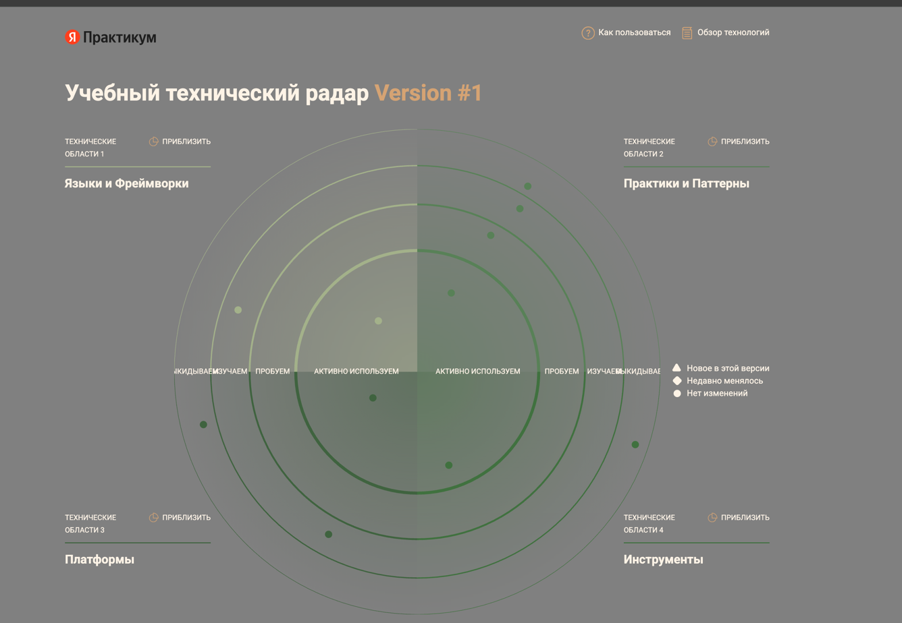
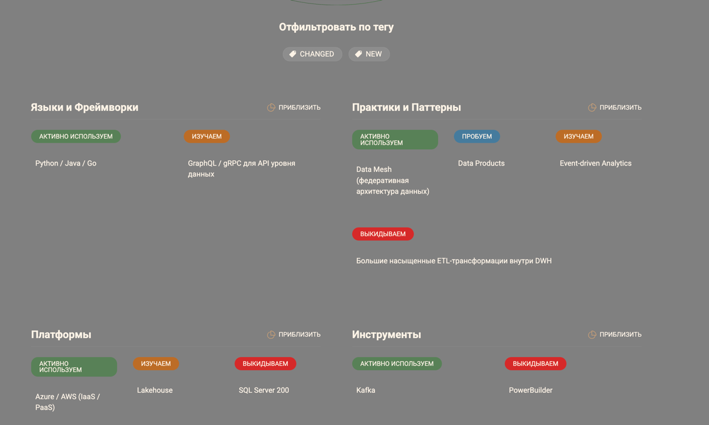
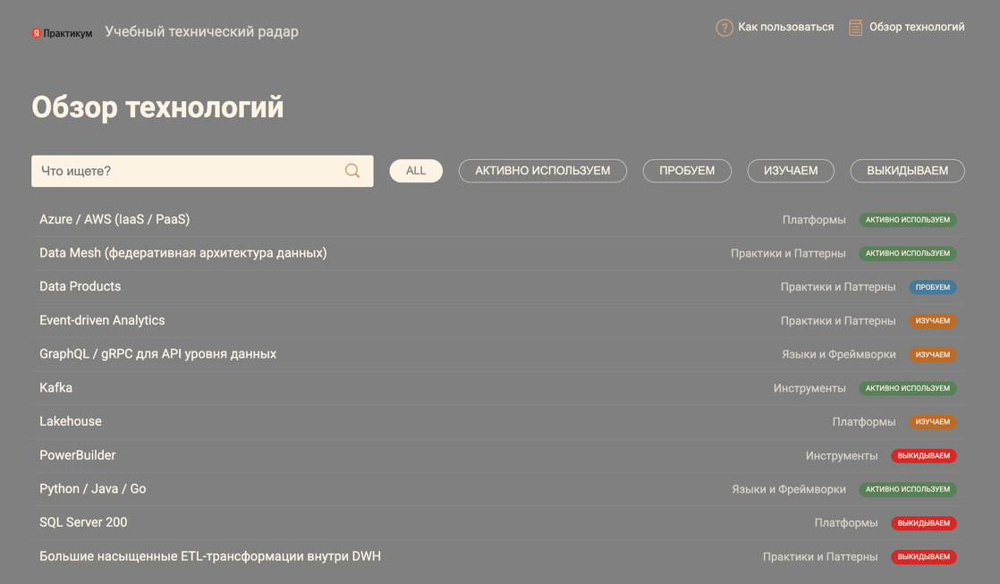

## Техрадар

1. cd tech_radar
2. npm run build
3. npm run serve
4. Открываем localhost:3000.

### Скриншоты

## Роадмап

| Этап                                           | Бизнес-цели                                                             | Ключевые инициативы / проекты                                                                        | Ожидаемые результаты                                                                                | Ответственные                                          | Ресурсы                                                                    |
|------------------------------------------------|-------------------------------------------------------------------------|------------------------------------------------------------------------------------------------------|-----------------------------------------------------------------------------------------------------|--------------------------------------------------------|----------------------------------------------------------------------------|
| Подготовительный                               | Установить архитектурные границы, оценить текущее состояние             | Архитектурная сессия, аудит DWH, облачная песочница + обучение                                       | Границы доменов определены, узкие места выявлены, среда в облаке запущена                           | Архитекторы, DWH-команда, DevOps                       | Внешние/внутренние консультанты, облачный аккаунт, инструменты мониторинга |
| Запуск платформы данных / Self-Serve           | Обеспечить базовую платформу для доменных данных                        | Каталог данных, управление безопасностью, dbt-трансформации пилота, messaging backbone               | Каталог работает, трансформации выполняются через платформу, шина сообщений функционирует           | Платформенная команда, Data engineers, Security        | Инструмент каталога, dbt-пайплайны, Kafka / Pulsar, настройка IAM          |
| Витрина самообслуживания + подключение доменов | Дать пользователям возможность строить отчёты, начать доменное развитие | Разработка витрины, подключение доменов медицина/ИИ, оптимизация отчетов, мониторинг качества данных | Портал запущен, домены публикуют data products, отчёты ускорены, метрики качества работают          | BI / frontend, команды доменов, platform team          | UI/UX, BI-библиотеки, вычислительные ресурсы, инструменты observability    |
| Интеграция доменов + отказ от легаси           | Расширить экосистему, уменьшить зависимость от центра                   | Подключение фарма/оборудования, перенос логики из DWH, внедрение streaming, переход интерфейсов      | Новые домены подключены, централизованные трансформации перенесены, интерфейсы обновлены            | Доменные команды, архитекторы, frontend, platform team | Pipelines, API, инструменты streaming, UI-стек, миграционные ресурсы       |
| Завершение миграции и масштабирование          | Полностью перейти к распределённой архитектуре                          | Перенос оставшихся отчётов, FinOps, внешние API интеграции, UX-итерации, резервирование/DR           | DWH используется как архив, затраты оптимизированы, партнёрские API функционируют, витрина улучшена | Platform / Infra / FinOps / интеграционные команды     | Инструменты FinOps, DR-инфраструктура, API-шлюзы, мониторинг, аналитика    |

## Обоснование для каждого этапа изменений.

| Этап                                           | Зачем нужен                                            | Как влияет                                                      | Ключевые преимущества                                                |
|------------------------------------------------|--------------------------------------------------------|-----------------------------------------------------------------|----------------------------------------------------------------------|
| Подготовительный                               | Установить базу, снизить риски                         | Чёткое разделение доменов, выявление узких мест                 | Ускорение последующих этапов, уменьшение сюрпризов                   |
| Запуск платформы данных / Self-Serve           | Дать технологическую основу для доменных data products | Уменьшение узких мест в централизованных ETL, рост автономии    | Быстрое создание продуктов, рост скорости изменения                  |
| Витрина самообслуживания + подключение доменов | Демократизация данных, отключение очередей на BI       | Пользователи строят отчёты сами, меньше зависимости от ИТ       | Сокращение времени принятия решений, снижение нагрузки на аналитиков |
| Интеграция новых доменов и отказ от легаси     | Масштабирование, устойчивость                          | Новые бизнес-направления подключаются без перегрузки центра     | Гибкость, независимость, рост возможностей                           |
| Завершение миграции и масштабирование          | Завершить переход, контролировать затраты и качество   | Легаси-системы уходят, управление расходами, отказоустойчивость | Оптимизированные расходы, высокая доступность и надёжность           |
