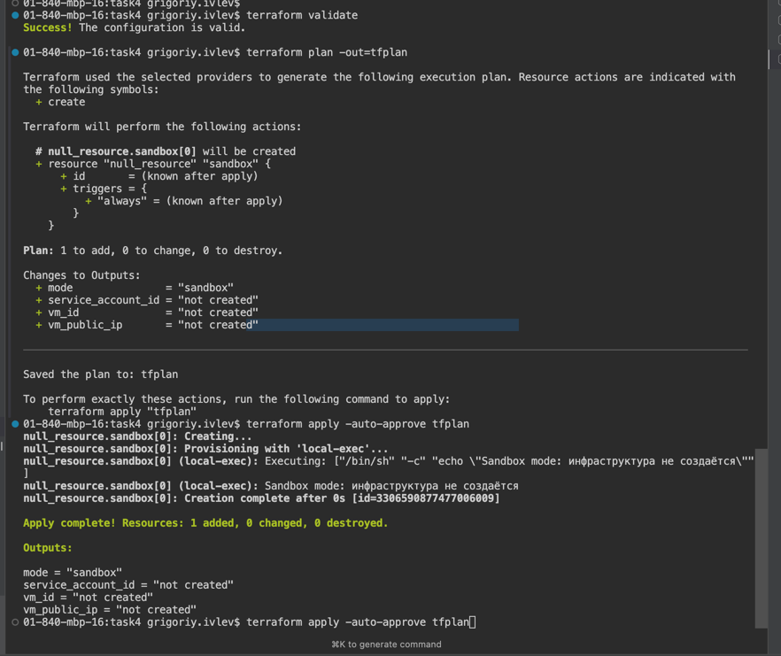

## Диаграмма автоматизации развертывания

Шаблон - https://plantuml.com/ru/deployment-diagram

[terraform-deploy-automation.puml](terraform-deploy-automation.puml)

## Terraform-конфигурация

### Запуск

1. Инициализация

```bash
terraform init
```

2.  Валидация конфигурации

```bash
terraform validate
```

3.  Планирование изменений

```bash
terraform plan -out=tfplan
```

4. Применение в режиме песочницы

```bash
terraform apply -auto-approve tfplan
```

Результат вызова



### Обоснование выбора

[justification.md](justification.md)
